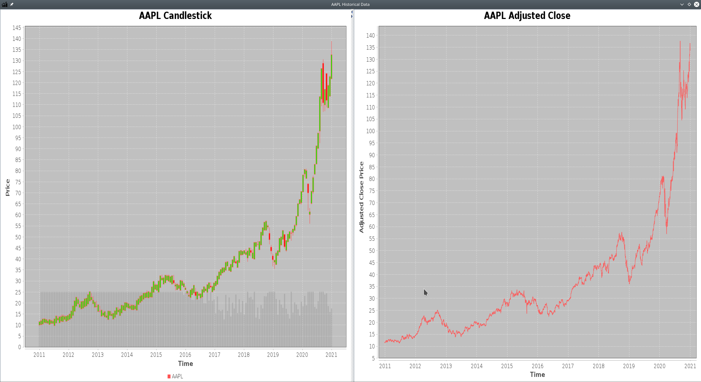

# StockSim: Stock Portfolio Simulator
StockSim is a Java application which, as main feature, allows users to simulate 
stock market portfolios. The StockSim application is composed by two main 
programs:
* StockSim Server: supposed to be running 24/7 to ensure historical data is
always up-to-date;
* StockSim Client: can be launched in either ```admin``` or ```user``` mode and
provides different functionalities based on the running mode.

The StockSim Server is not thought to be distributed to end users and is
intended to be running on a Server machine, whereas the StockSim Client can be
used by both administrators and normal users. The choice was made to provide the
same program to both administrators and normal users with two different running
modes. Administrators can add new ticker symbols, new administrator accounts,
delete both administrator and normal user accounts. Normal users have access to
stocks and ETFs historical data, day by day, starting from 2010. They can search
for and visualize Stocks, create their own stock portfolios, run simulations and
visualize the resulting statistics.

All the programs are terminal based but the StockSim Client, running in
```user``` mode, can display charts resulting from the different operations
performed on stocks.



## Database
StockSim relys upon both a MongoDB Cluster and an Apache Cassandra Cluster.


## How To Use
The Intellij IDEA Java project can be found in the ```Stocksim``` directory.
Just open it in the Intellij IDEA IDE and generate the JARs with the following
command:
```bash
mvn package

[INFO] ------------------------------------------------------------------------
[INFO] Reactor Summary for Stocksim 1.0:
[INFO] 
[INFO] Stocksim ........................................... SUCCESS [  0.001 s]
[INFO] Library ............................................ SUCCESS [  0.820 s]
[INFO] Client ............................................. SUCCESS [  6.287 s]
[INFO] Server ............................................. SUCCESS [  5.337 s]
[INFO] ------------------------------------------------------------------------
[INFO] BUILD SUCCESS
[INFO] ------------------------------------------------------------------------
[INFO] Total time:  12.514 s
[INFO] Finished at: 2021-01-24T12:58:10+01:00
[INFO] ------------------------------------------------------------------------
```
you will then find the JARs with the dependencies in the ```targer``` directory
of each module.

Execute with the following command:
```bash
java -jar Server-1.0-jar-with-dependencies.jar
```
or
```bash
java -jar Client-1.0-jar-with-dependencies.jar
```
